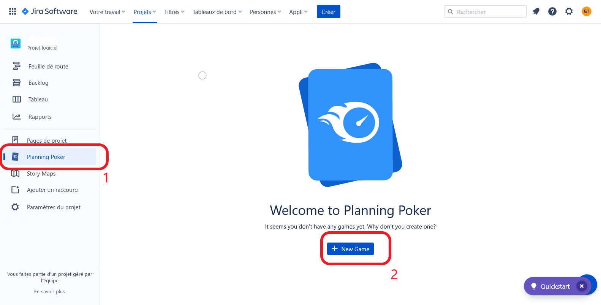

# Exercice 4 : Planning Poker

## Ressources

- Utilisez le logiciel ***Jira***
- Utilisez l'extension *Planning Poker*

## Énoncé

À partir de votre *product backlog*, estimez la complexité de vos 3 *US* les plus prioritaires.

1. Votez en utilisant l'extension *Planning Poker* (gardez la suite de Fibonacci pour les estimations).
- En cas d'écart, confrontez les membres de l'équipe qui ont voté aux extrêmes (note la plus basse et note la plus élevée) pour avoir les arguments de chacun et revotez pour avoir un consensus sur l'estimation.
En cas de débat, il faut time-boxer (1 à 3 min par personne (devs avec les notes extrêmes) pour argumenter son vote).

## Aide pour la configuration de l'extension *Planning Poker*

### Correction

Un développeur de chaque groupe exposera les estimations de son équipe pour 1 à 2 *US* en parlant du déroulement du vote.

